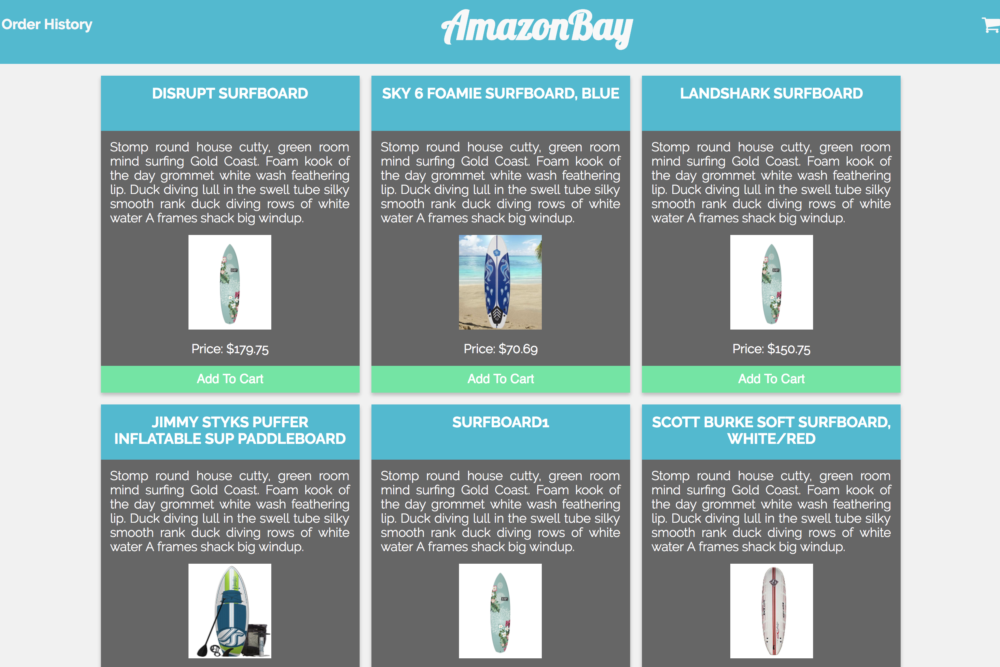

# AmazonBay-Instrumented

This project is spin-off from AmazonBay, a simple e-commerce application built in 8 hours with frontend user interface (HTML, CSS, jQuery) and the backend built out with Node/Express, PostgreSQL, and Knex.

In this version, the application has been instrumented and is collecting metrics using [IBM's Node Metrics Library](https://github.com/RuntimeTools/appmetrics). It's then sending them to be stored within [InfluxDB](https://docs.influxdata.com/influxdb/v1.5/introduction/installation/) via [Telegraf](https://docs.influxdata.com/telegraf/v1.5/introduction/installation/), an open source data collecting agent.

Further detail is outlined in this blog post: [Instrumenting your Node/Express Application](https://www.influxdata.com/blog/instrumenting-your-node-express-application/)

## To Use

Clone down this repo

`npm install`

This repo uses Postgres, which you will need to install and then manually create the databases: amazonbay and amazonbay_test

Run `psql`

`# CREATE DATABASE amazonbay;`

`# CREATE DATABASE amazonbay_test;`

To quit: `\q`

Run `knex migrate:latest` to get the latest migration.

Run `knex seed:run` to seed the databases with sample data.

Run `node server.js` to start the server and navigate to localhost:3000 to view the app.

Run `npm test` to run the test suite.

## Images

#### Author

This application was created by Margo Schaedel
